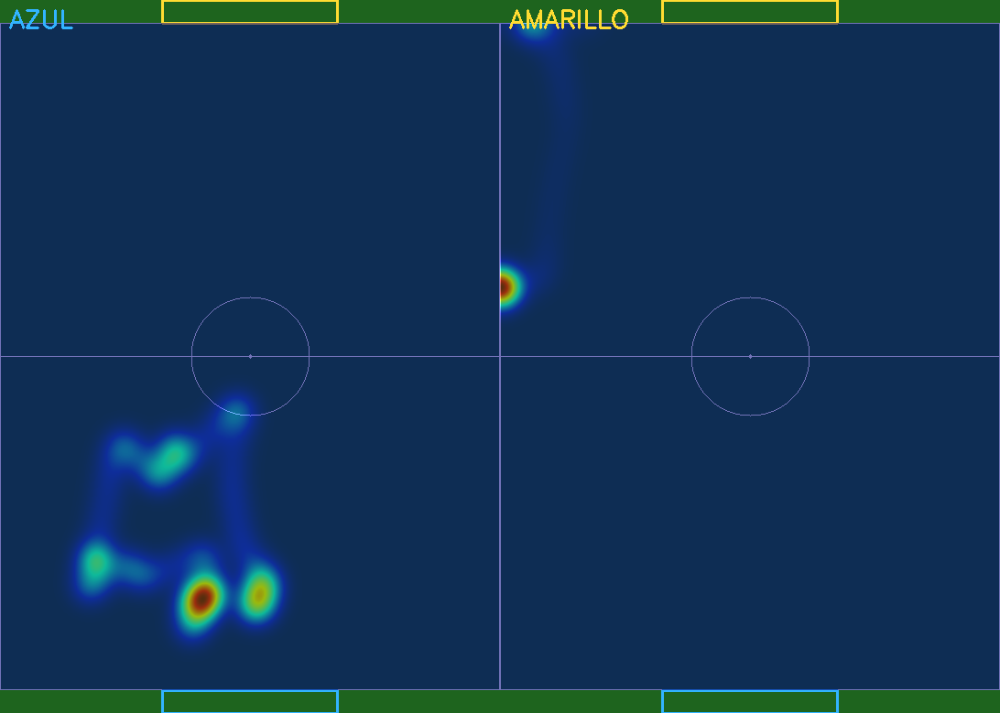
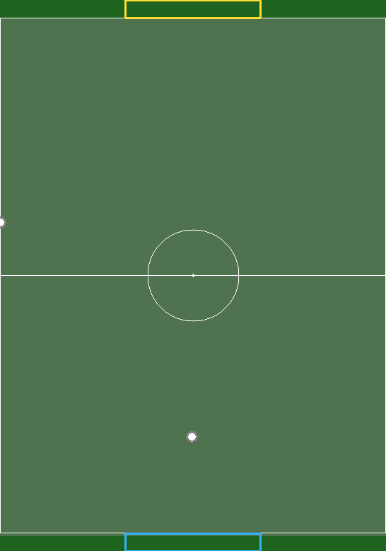
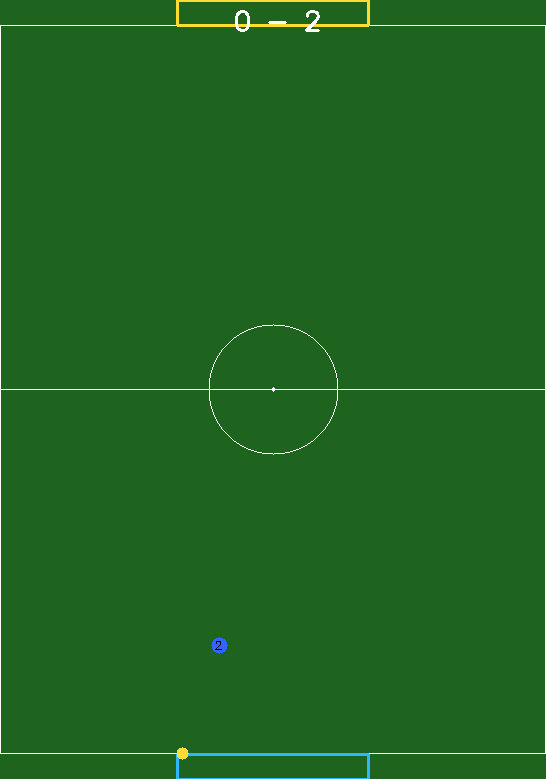

# Copa FutBotMX 2026 — Análisis de Fútbol Robótico por Visión por Computadora

Sistema completo de análisis de partidos de fútbol robótico mediante visión por
computadora, con reconstrucción y visualización 3D en Blender. Procesa el video
de un partido en un solo pase y genera métricas, mapas tácticos (heatmap,
posesión, Voronoi, grafo de interacción) y una recreación 3D animada del partido
con narrador.

**Equipo:** 67ers · **Categoría:** Amateur · **Plataforma:** Local (Windows, GPU NVIDIA)

---

## Enfoque y arquitectura

El sistema se divide en dos etapas conectadas por un archivo JSON intermedio,
lo que permite procesar el video una vez (en una máquina con GPU) y visualizarlo
en 3D cuantas veces se quiera, incluso en otra máquina.

```
Video del partido
        |
        v
YOLOv8 + ByteTrack  ->  Detección y tracking (Robot, Ball)
        |
        v
Homografía  ->  Coordenadas reales del campo (cm)
        |
        +--> Métricas (distancia, velocidad)
        +--> Eventos (posesión, pases, disparos, colisiones, goles)
        |
        v
Análisis tácticos (PNG + MP4):
   heatmap - posesión - Voronoi - grafo de interacción
        |
        v
JSON para Blender + secuencias PNG
        |
        v
Reconstrucción 3D (Blender) + narrador
```

El código está modularizado: cada archivo en `src/` tiene una sola
responsabilidad, y `run.py` orquesta el flujo de forma lineal.

---

## 1. Flujo de procesamiento y seguimiento

**Segmentación del dataset (SAM 3).** Las dos clases del dataset (Robot y Ball)
se anotaron con segmentación poligonal usando SAM 3 dentro de Roboflow. SAM 3 se
usó solo en la preparación del dataset, no en la inferencia: el sistema en
tiempo de ejecución detecta con el modelo YOLOv8 entrenado (`modelo/best.pt`).
Se documenta así por transparencia.

**Detección y tracking.** YOLOv8 detecta robots y balón en cada frame; ByteTrack
mantiene un ID consistente por objeto a lo largo del video. La configuración del
tracker (`config/bytetrack_custom.yaml`) está ajustada para que los robots no
pierdan su ID al desaparecer momentáneamente (oclusiones).

**Equipos.** Cada robot se asigna a un equipo (azul/amarillo) según la mitad del
campo donde inicia, distinguiendo robots aliados de rivales.

**Proyección al campo real.** Mediante homografía, las posiciones en píxeles se
convierten a coordenadas reales del campo (182 × 243 cm), en centímetros.

**Eventos detectados.** A partir de las trayectorias se detectan:
- Posesión del balón
- Pases entre robots
- Disparos a portería
- Colisiones entre robots
- Goles

---

## 2. Visualización y narrativa de datos

Cada análisis se genera como imagen (PNG) y video (MP4):

- **Heatmap** de posiciones por equipo (dónde se concentra cada equipo)
- **Mapa de posesión** con porcentaje por equipo
- **Diagrama de Voronoi** (territorio dominado por cada equipo)
- **Grafo de interacción** (eventos del partido como aristas)

Además, la **reconstrucción 3D en Blender** anima el partido completo (robots,
balón, marcador dinámico) y proyecta el heatmap y el Voronoi sobre el césped en
tiempo real. Un **narrador "pato" con lip-sync** comenta los eventos del partido.

---

## 3. Resultados

Capturas generadas por el sistema sobre un partido de ejemplo:

### Heatmap de posiciones por equipo


### Diagrama de Voronoi (territorio dominado)


### Grafo de interacción (eventos)


> Los videos animados (MP4) de cada análisis y la reconstrucción 3D se generan
> al correr el sistema (ver sección Uso).

---

## 4. Videos

- **Video demo (≤2 min):** https://drive.google.com/file/d/1WuQIlbWRETnyXwF40nuMxfsBciTGkTtf/view?usp=sharing
- **Reel de Instagram (≥30 seg):** https://www.instagram.com/reel/DZycG8fNGz-/

---

## Requisitos de hardware y software

**Hardware:**
- GPU NVIDIA con CUDA 12.1 (recomendado; probado en RTX 3050)
- ~4 GB de espacio para entorno y dependencias

**Software:**
- **Python 3.10** (importante: el stack de PyTorch + CUDA usado requiere 3.10;
  no uses 3.11/3.12 para evitar incompatibilidades con `torch==2.5.1+cu121`)
- Blender 4.3.2 (para la parte 3D)
- Conda (recomendado)

---

## Instalación (paso a paso)

> Nota: ejecuta cada comando en su propia línea. Las rutas de Windows usan `\`
> (por ejemplo `C:\Users\...`); eso es correcto. No partas comandos con `\`.

```bash
# 0. (Si no tienes Git) instálalo con conda
conda install -c anaconda git -y

# 1. Clonar el repo
git clone https://github.com/Western-cmyk/Copa-FutBotMX-Visi-n-por-computadora-2026.git
cd Copa-FutBotMX-Visi-n-por-computadora-2026

# 2. Crear entorno con Python 3.10
conda create -n cv_curso python=3.10 -y
conda activate cv_curso

# 3. Instalar PyTorch con CUDA 12.1 PRIMERO (desde su índice oficial)
pip install torch==2.5.1 torchvision==0.20.1 --index-url https://download.pytorch.org/whl/cu121

# 4. Instalar el resto de dependencias
pip install -r requirements.txt
```

Verifica que CUDA quedó bien:

```bash
python -c "import torch; print(torch.cuda.is_available())"
```

Debe imprimir `True`.

> ADVERTENCIA: NUNCA corras `pip install -U torch`. Reemplaza tu versión por la
> de CPU y rompe la aceleración por GPU.

---

## Assets pesados (Google Drive)

Los modelos 3D, los videos de ejemplo y los sprites del narrador no se incluyen
en el repositorio por su tamaño. Se descargan desde Google Drive:

**[Carpeta de assets en Google Drive](https://drive.google.com/drive/folders/1eKLdj8UJ7WWgIY1YFM9nV6OMA2md66Mm?usp=sharing)**

Contenido:
```
Copa-FutBotMX - Modelos 3D/
├── Robot1.blend          -> renombrar a robot_azul.blend (va en blender/modelos/)
├── Robot2.blend          -> renombrar a robot_amarillo.blend (va en blender/modelos/)
├── Partido_ejemplo.mp4   -> video de prueba (va en datos/ejemplo/)
├── Partido_ejemplo2.mp4  -> video de prueba alterno
└── Merlin Caras/         -> sprites del pato + "Fondo estadio.png"
```

> Los modelos 3D detallados son opcionales: si no se colocan en
> `blender/modelos/`, el motor 3D genera robots de respaldo automáticamente.

---

## Uso

### 1. Coloca tu video

El sistema busca por defecto el video en `datos/ejemplo/partido.mp4`. Cada equipo
puede usar su propio video de dos formas:

**Opción A — con el nombre por defecto:** descarga un video del Drive, renómbralo
a `partido.mp4` y ponlo en `datos/ejemplo/`. Luego:
```bash
python run.py
```

**Opción B — pasando la ruta de tu video:**
```bash
python run.py --video "C:\ruta\a\tu\video.mp4" --nombre mi_partido
```

> La ruta del video es lo único que cambia según tu máquina. El resto del
> sistema usa rutas relativas al repo.

### 2. Resultados generados

`run.py` crea desde cero la carpeta `resultados/renders/` con todos los datos del
partido procesado:
- `resultados/renders/blender/<nombre>.json` — datos del partido para Blender
- `resultados/renders/analisis/<nombre>/` — heatmap, posesión, Voronoi y grafo
  (PNG + MP4) y las secuencias PNG para proyectar en el césped 3D.

### 3. Reconstrucción 3D (Blender)

1. Abre Blender 4.3.2 → pestaña **Scripting** → abre `blender/motor_3d_partido.py`.

> IMPORTANTE — Ajusta la ruta en Blender: al inicio del script, edita
> `BASE_DIR_MANUAL` con la ruta del repo EN TU PC. Por ejemplo:
> `BASE_DIR_MANUAL = r"C:\Users\TU_USUARIO\Copa-FutBotMX-Visi-n-por-computadora-2026"`
> Es necesario porque Blender no detecta la ubicación del script desde su editor
> interno. Cada equipo pone aquí su propia ruta.

2. **Run Script** (Alt+P) → tecla **N** → pestaña **"Partido"** → selecciona el
   partido → **"Cargar partido"**.
3. Usa los toggles de **Heatmap** y **Voronoi** y los botones de cámara.

### 4. Narrador (opcional)

En Blender: **Scripting** → abre `blender/merlin_ui.py` → **Run Script**. En el
panel "Pato", selecciona la carpeta `Merlin Caras` (de Drive), carga un archivo
WAV de narración y usa "Hornear animación" → "Renderizar video".

> El WAV de narración no se incluye: cada equipo genera o graba el suyo, y lo
> carga desde el panel del narrador.

---

## Estructura del repositorio

```
.
├── run.py                      # Punto de entrada del análisis
├── README.md, LICENSE, requirements.txt, .gitignore
├── config/
│   └── bytetrack_custom.yaml   # Config de tracking (ajustable por equipo)
├── src/                        # Módulos del pipeline
│   ├── config.py               # Parámetros globales y rutas
│   ├── campo.py                # Homografía y geometría
│   ├── deteccion.py            # Clase Detector (YOLOv8 + ByteTrack)
│   ├── equipos.py              # Detección de equipos
│   ├── metricas.py             # Distancia y velocidad
│   ├── grafo.py                # Eventos del partido
│   └── analisis.py             # Generación de visualizaciones
├── blender/
│   ├── motor_3d_partido.py     # Reconstrucción 3D
│   ├── merlin_ui.py            # Narrador pato
│   └── modelos/                # .blend de robots (ver Drive)
├── modelo/
│   ├── best.pt                 # Modelo YOLOv8 entrenado
│   └── homografia.npy          # Matriz de homografía
├── datos/ejemplo/              # Video de entrada
└── resultados/                 # Capturas de ejemplo
```

---

## Tecnologías

- **Detección/Tracking:** YOLOv8, ByteTrack (Ultralytics)
- **Anotación de dataset:** SAM 3 vía Roboflow (solo preparación, no inferencia)
- **Visión:** OpenCV, homografía
- **Análisis:** NumPy, SciPy
- **3D:** Blender 4.3.2 (EEVEE Next)

## Mejoras futuras

- Re-identificación visual (DINOv3) para reforzar el tracking tras oclusiones
  prolongadas y cruces entre robots del mismo equipo.
- Detección de intercepciones como evento adicional.

---

## Licencia y créditos

Licencia **MIT** — ver [LICENSE](LICENSE).

**Equipo 67ers** — ITESM Campus Cuernavaca

**Herramientas y modelos de terceros:**
- Ultralytics YOLOv8 / ByteTrack
- Meta SAM 3 (vía Roboflow) para anotación del dataset
- Modelos 3D de robots generados con Meshy AI
- Blender Foundation (Blender 4.3.2)